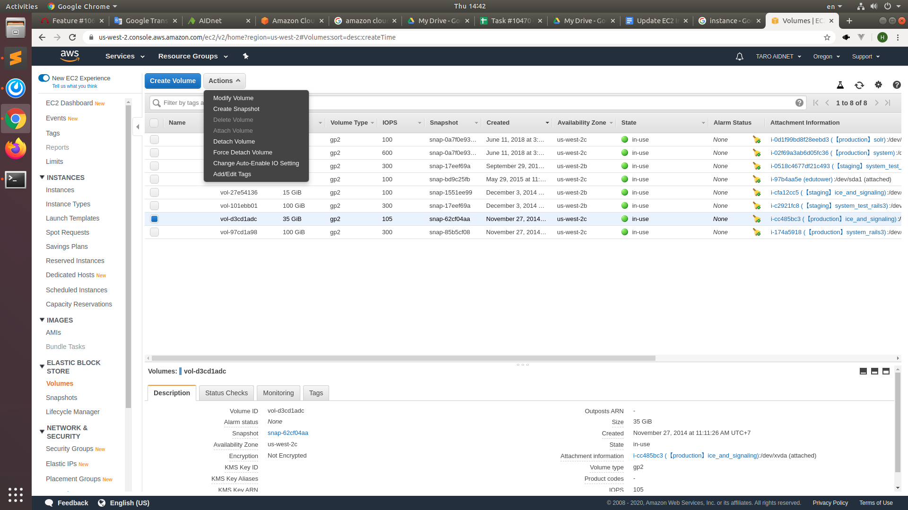
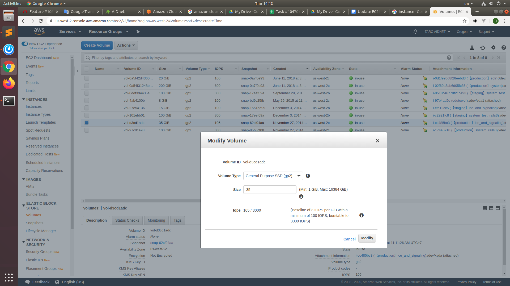
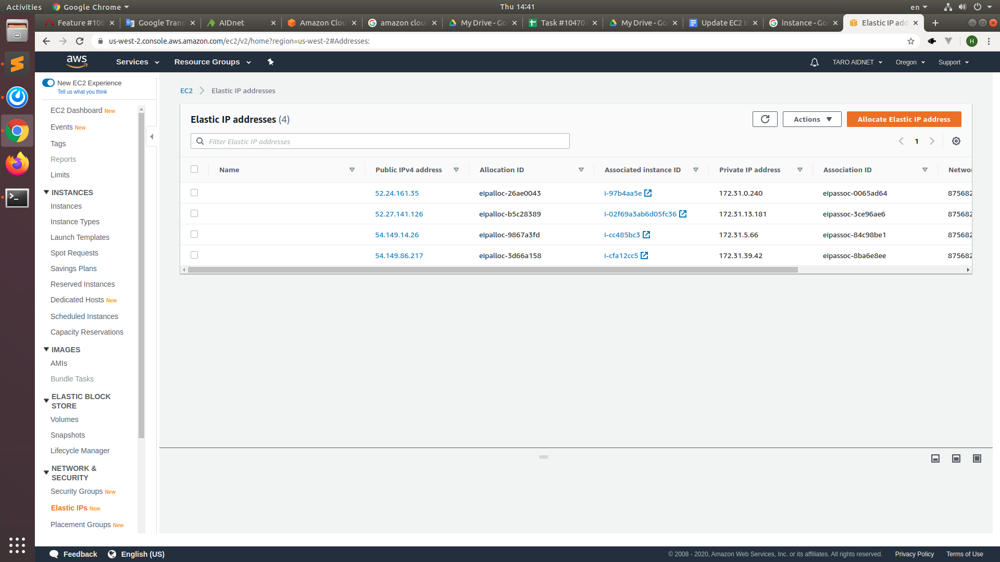
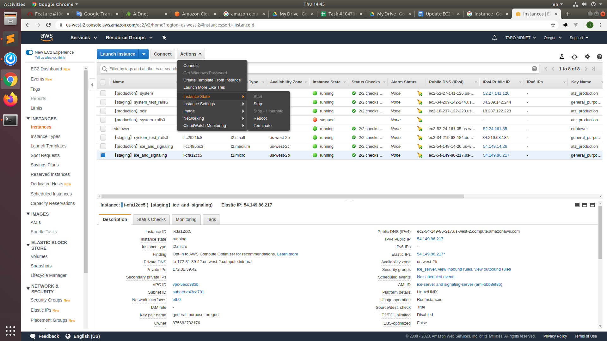
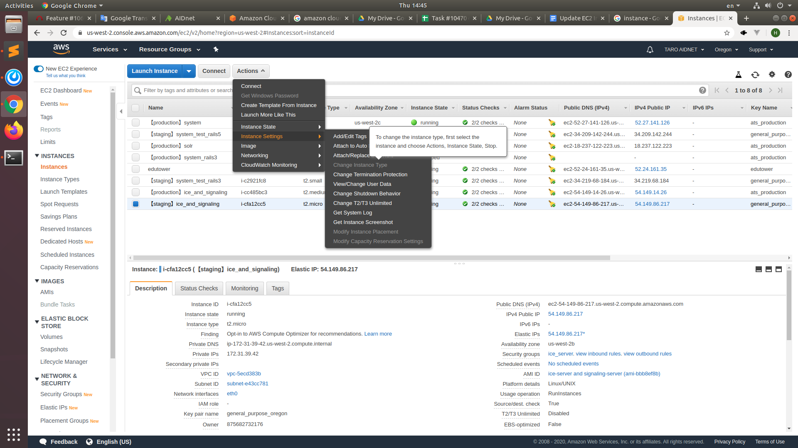

# How to update EC2 Instance

## Extend EBS columns (zero downtime)
1. Backup data
2. Create snapshot (If change instance type, creating image will create a snapshot so this step can be skipped)

3. Modify volume

4. Check in server with command `df -h`

## Change instance type
1. Verify Elastic IP

2. Create Image
3. Stop instance

4. Change instance type

5. Start instance
6. Check in server with command `top`
